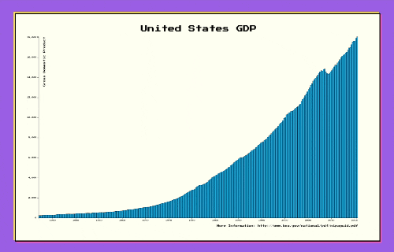

# Bar Chart [30 Jan 2023]

## Table of contents

- [Overview](#overview)
  - [Screenshot](#screenshot)
  - [Links](#links)
- [My process](#my-process)
  - [Built with](#built-with)
  - [What I learned](#what-i-learned)
  - [Useful resources](#useful-resources)
- [Author](#author)
- [Acknowledgments](#acknowledgments)

## Overview

### Screenshot

### Links

[Codepend to the project](https://codepen.io/haanna/pen/VwBBWaG)

## My process

I started from writing a basic HTML structure and choosing a design style and fonts. Then I fetched the data, and coded the chart.

### Built with

- HTML
- CSS
- Vanilla JavaScript
- D3.js

### What I learned

How to create bar charts in D3.js, how to use scales, text, and assign various attributes.

### Useful resources

- [Free Code Camp](https://www.freecodecamp.org/learn)

## Author

- Website - [Ha Anna](https://haanna.com)
- Codepen - [haanna](https://codepen.io/haanna)

## Acknowledgments

Thank you, Free Code Camp for creating this course and making it free and accessible to everyone.

