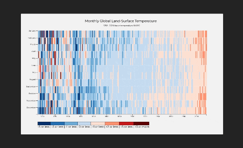

# Heat map [1 Feb 2023]

## Table of contents

- [Overview](#overview)
  - [Screenshot](#screenshot)
  - [Links](#links)
- [My process](#my-process)
  - [Built with](#built-with)
  - [What I learned](#what-i-learned)
  - [Useful resources](#useful-resources)
- [Author](#author)
- [Acknowledgments](#acknowledgments)

## Overview

**Objective:** Build an app that is functionally similar to this: https://heat-map.freecodecamp.rocks.

Fulfill the below user stories and get all of the tests to pass. 

**User Story #1:** My heat map should have a title with a corresponding id="title".  
**User Story #2:** My heat map should have a description with a corresponding id="description".  
**User Story #3:** My heat map should have an x-axis with a corresponding id="x-axis".  
**User Story #4:** My heat map should have a y-axis with a corresponding id="y-axis".  
**User Story #5:** My heat map should have rect elements with a class="cell" that represent the data.  
**User Story #6:** There should be at least 4 different fill colors used for the cells.  
**User Story #7:** Each cell will have the properties data-month, data-year, data-temp containing their corresponding month, year, and temperature values.  
**User Story #8:** The data-month, data-year of each cell should be within the range of the data.  
**User Story #9:** My heat map should have cells that align with the corresponding month on the y-axis.  
**User Story #10:** My heat map should have cells that align with the corresponding year on the x-axis.  
**User Story #11:** My heat map should have multiple tick labels on the y-axis with the full month name.  
**User Story #12:** My heat map should have multiple tick labels on the x-axis with the years between 1754 and 2015.  
**User Story #13:** My heat map should have a legend with a corresponding id="legend".  
**User Story #14:** My legend should contain rect elements.  
**User Story #15:** The rect elements in the legend should use at least 4 different fill colors.  
**User Story #16:** I can mouse over an area and see a tooltip with a corresponding id="tooltip" which displays more information about the area.  
**User Story #17:** My tooltip should have a data-year property that corresponds to the data-year of the active area.  

Here is the dataset you will need to complete this project: https://raw.githubusercontent.com/freeCodeCamp/ProjectReferenceData/master/global-temperature.json

### Screenshot

### Links

[Codepen](https://codepen.io/haanna/pen/YzjOorv)

## My process

I started from writing a basic HTML structure and choosing a design style and fonts. Then I fetched the data, and coded the chart.

### Built with

- HTML
- CSS
- Vanilla JavaScript
- D3.js

### What I learned

How to create bar charts in D3.js, how to use scales, text, and assign various attributes.

### Useful resources

- [Free Code Camp](https://www.freecodecamp.org/learn)

## Author

- Website - [Ha Anna](https://haanna.com)
- Codepen - [haanna](https://codepen.io/haanna)

## Acknowledgments

Thank you, Free Code Camp for creating this course and making it free and accessible to everyone.

