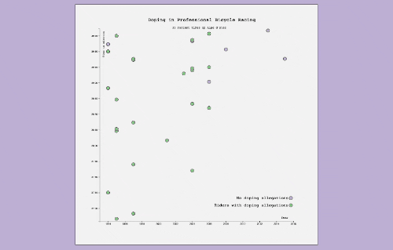

# Bar Chart [30 Jan 2023]

## Table of contents

- [Overview](#overview)
  - [Screenshot](#screenshot)
  - [Links](#links)
- [My process](#my-process)
  - [Built with](#built-with)
  - [What I learned](#what-i-learned)
  - [Useful resources](#useful-resources)
- [Author](#author)
- [Acknowledgments](#acknowledgments)

## Overview

**Objective:** Build an app that is functionally similar to this: https://scatterplot-graph.freecodecamp.rocks.

Fulfill the below user stories and get all of the tests to pass. 

**User Story #1:** I can see a title element that has a corresponding id="title".  
**User Story #2:** I can see an x-axis that has a corresponding id="x-axis".  
**User Story #3:** I can see a y-axis that has a corresponding id="y-axis".  
**User Story #4:** I can see dots, that each have a class of dot, which represent the data being plotted.  
**User Story #5:** Each dot should have the properties data-xvalue and data-yvalue containing their corresponding x and y values.  
**User Story #6:** The data-xvalue and data-yvalue of each dot should be within the range of the actual data and in the correct data format. For data-xvalue, integers (full years) or Date objects are acceptable for test evaluation. For data-yvalue (minutes), use Date objects.  
**User Story #7:** The data-xvalue and its corresponding dot should align with the corresponding point/value on the x-axis.  
**User Story #8:** The data-yvalue and its corresponding dot should align with the corresponding point/value on the y-axis.  
**User Story #9:** I can see multiple tick labels on the y-axis with %M:%S time format.  
**User Story #10:** I can see multiple tick labels on the x-axis that show the year.  
**User Story #11:** I can see that the range of the x-axis labels are within the range of the actual x-axis data.  
**User Story #12:** I can see that the range of the y-axis labels are within the range of the actual y-axis data.  
**User Story #13:** I can see a legend containing descriptive text that has id="legend".  
**User Story #14:** I can mouse over an area and see a tooltip with a corresponding id="tooltip" which displays more information about the area.  
**User Story #15:** My tooltip should have a data-year property that corresponds to the data-xvalue of the active area.  

Here is the dataset you will need to complete this project: https://raw.githubusercontent.com/freeCodeCamp/ProjectReferenceData/master/cyclist-data.json

### Screenshot

### Links

[Codepen](https://codepen.io/haanna/pen/VwBBWaG)

## My process

I started from writing a basic HTML structure and choosing a design style and fonts. Then I fetched the data, and coded the chart.

### Built with

- HTML
- CSS
- Vanilla JavaScript
- D3.js

### What I learned

How to create bar charts in D3.js, how to use scales, text, and assign various attributes.

### Useful resources

- [Free Code Camp](https://www.freecodecamp.org/learn)

## Author

- Website - [Ha Anna](https://haanna.com)
- Codepen - [haanna](https://codepen.io/haanna)

## Acknowledgments

Thank you, Free Code Camp for creating this course and making it free and accessible to everyone.

