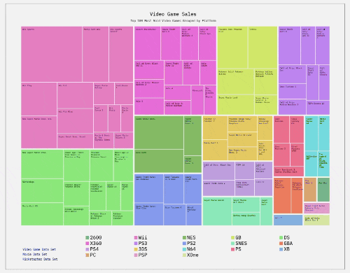

# Tree Map Diagram [2 Feb 2023]

## Table of contents

- [Overview](#overview)
  - [Screenshot](#screenshot)
  - [Links](#links)
- [My process](#my-process)
  - [Built with](#built-with)
  - [What I learned](#what-i-learned)
  - [Useful resources](#useful-resources)
- [Author](#author)
- [Acknowledgments](#acknowledgments)

## Overview

**Objective:** Build an app that is functionally similar to this: https://treemap-diagram.freecodecamp.rocks.

Fulfill the below user stories and get all of the tests to pass. 

**User Story #1:** My tree map should have a title with a corresponding id="title".  
**User Story #2:** My tree map should have a description with a corresponding id="description".  
**User Story #3:** My tree map should have rect elements with a corresponding class="tile" that represent the data.  
**User Story #4:** There should be at least 2 different fill colors used for the tiles.  
**User Story #5:** Each tile should have the properties data-name, data-category, and data-value containing their corresponding name, category, and value.  
**User Story #6:** The area of each tile should correspond to the data-value amount: tiles with a larger data-value should have a bigger area.  
**User Story #7:** My tree map should have a legend with corresponding id="legend".  
**User Story #8:** My legend should have rect elements with a corresponding class="legend-item".  
**User Story #9:** The rect elements in the legend should use at least 2 different fill colors.  
**User Story #10:** I can mouse over an area and see a tooltip with a corresponding id="tooltip" which displays more information about the area.  
**User Story #11:**  My tooltip should have a data-value property that corresponds to the data-value of the active area.  

For this project you can use any of the following datasets:

- Kickstarter Pledges: https://cdn.freecodecamp.org/testable-projects-fcc/data/tree_map/kickstarter-funding-data.json
- Movie Sales: https://cdn.freecodecamp.org/testable-projects-fcc/data/tree_map/movie-data.json
- Video Game Sales: https://cdn.freecodecamp.org/testable-projects-fcc/data/tree_map/video-game-sales-data.json

### Screenshot

### Links

[Codepen](https://codepen.io/haanna/pen/OJwaqXv)

## My process

I started from writing a basic HTML structure and choosing a design style and fonts. Then I fetched the data, and coded the chart.

### Built with

- HTML
- CSS
- Vanilla JavaScript
- D3.js

### What I learned

How to create bar charts in D3.js, how to use scales, text, and assign various attributes.

### Useful resources

- [Free Code Camp](https://www.freecodecamp.org/learn)

## Author

- Website - [Ha Anna](https://haanna.com)
- Codepen - [haanna](https://codepen.io/haanna)

## Acknowledgments

Thank you, Free Code Camp for creating this course and making it free and accessible to everyone.

